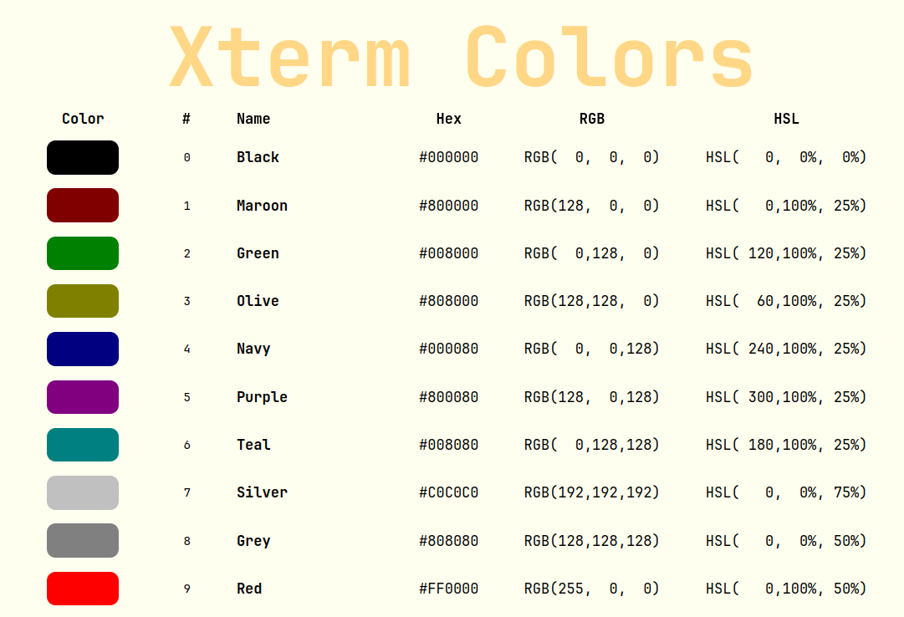

# Xterm Colors Cheat Sheet [🔗 Open Web](https://lucianofedericopereira.github.io/xterm-colors-cheat-sheet)

A comprehensive cheat sheet for all 255 xterm colors, designed to aid developers and designers alike. This tool, crafted with JavaScript, HTML, and CSS, features an interactive table where you can click on any color name or value (including HEX, RGB, and HSL) to copy it to your clipboard instantly. Streamline your workflow with easy access to terminal colors. The project is open-source and MIT Licensed. Visit our GitHub repository for more details and contributions. [MIT Licensed](LICENSE).

[🔗 Open Web](https://lucianofedericopereira.github.io/xterm-colors-cheat-sheet) - [🔗 See Code](index.html)
